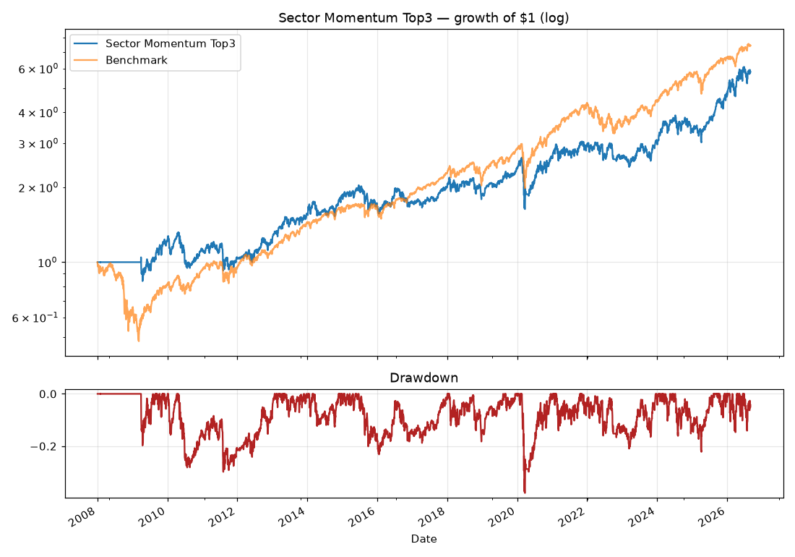

# Backtest: Sector Momentum Top3

Monthly rotation into the 3 sector ETFs with the highest 12-1 month momentum, only if above their 200-day average; equal weight; cash otherwise. 5 bps cost per unit turnover.

**Period:** 2008-01-02 → 2026-09-02 · **Costs:** modeled per rebalance · **Avg annual turnover:** 7.1x

## Summary
| Metric | Sector Momentum Top3 | Benchmark |
|---|---|---|
| CAGR | 9.91% | 11.35% |
| Vol | 21.28% | 19.75% |
| Sharpe | 0.55 | 0.64 |
| Sortino | 0.68 | 0.79 |
| MaxDD | -37.93% | -51.87% |
| Calmar | 0.26 | 0.22 |
| WinRate | 50.22% | 55.06% |
| BestDay | 11.93% | 14.52% |
| WorstDay | -15.92% | -10.94% |
| Total | 482.03% | 641.22% |
| Years | 18.64 | 18.64 |

## Robustness (sample halves)
| Metric | Full | 1st half | 2nd half |
|---|---|---|---|
| CAGR | 9.91% | 5.99% | 13.97% |
| Sharpe | 0.55 | 0.40 | 0.68 |
| MaxDD | -37.93% | -29.84% | -37.93% |

## Calendar-year returns
| Year | Sector Momentum Top3 | Benchmark |
|---|---|---|
| 2008 | +0.0% | -36.2% |
| 2009 | +21.0% | +26.4% |
| 2010 | -7.2% | +15.1% |
| 2011 | -7.3% | +1.9% |
| 2012 | +16.7% | +16.0% |
| 2013 | +28.8% | +32.3% |
| 2014 | +16.7% | +13.5% |
| 2015 | -7.4% | +1.2% |
| 2016 | +2.0% | +12.0% |
| 2017 | +15.5% | +21.7% |
| 2018 | -5.7% | -4.6% |
| 2019 | +26.4% | +31.2% |
| 2020 | +10.4% | +18.3% |
| 2021 | +12.0% | +28.7% |
| 2022 | -9.8% | -18.2% |
| 2023 | +16.4% | +26.2% |
| 2024 | +8.2% | +24.9% |
| 2025 | +38.4% | +17.7% |
| 2026 | +26.0% | +12.8% |

_Generated 2026-09-03 by Claude Space backtester. Past performance is not indicative of future results. Research, not investment advice._
