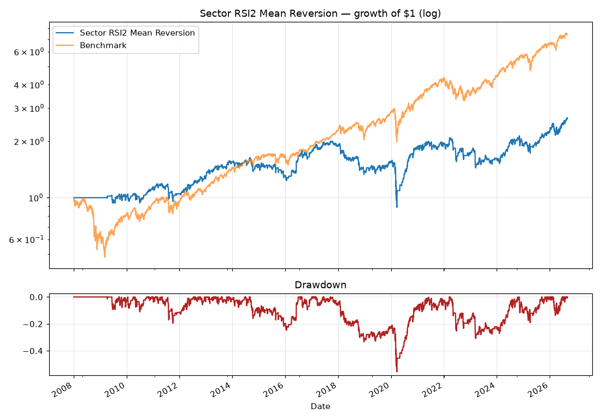

# Backtest: Sector RSI2 Mean Reversion

Buy sector ETFs when 2-day RSI < 10 while above the 200-day average; exit when RSI2 > 70. Equal-weight across open positions. Daily.

**Period:** 2008-01-02 → 2026-09-02 · **Costs:** modeled per rebalance · **Avg annual turnover:** 94.5x

## Summary
| Metric | Sector RSI2 Mean Reversion | Benchmark |
|---|---|---|
| CAGR | 5.40% | 11.35% |
| Vol | 18.36% | 19.75% |
| Sharpe | 0.38 | 0.64 |
| Sortino | 0.39 | 0.79 |
| MaxDD | -55.61% | -51.87% |
| Calmar | 0.10 | 0.22 |
| WinRate | 32.94% | 55.06% |
| BestDay | 12.18% | 14.52% |
| WorstDay | -13.68% | -10.94% |
| Total | 166.62% | 641.22% |
| Years | 18.64 | 18.64 |

## Robustness (sample halves)
| Metric | Full | 1st half | 2nd half |
|---|---|---|---|
| CAGR | 5.40% | 6.63% | 4.19% |
| Sharpe | 0.38 | 0.49 | 0.30 |
| MaxDD | -55.61% | -24.72% | -55.61% |

## Calendar-year returns
| Year | Sector RSI2 Mean Reversion | Benchmark |
|---|---|---|
| 2008 | +0.0% | -36.2% |
| 2009 | +0.9% | +26.4% |
| 2010 | +12.0% | +15.1% |
| 2011 | -7.1% | +1.9% |
| 2012 | +21.7% | +16.0% |
| 2013 | +21.3% | +32.3% |
| 2014 | -2.8% | +13.5% |
| 2015 | -12.8% | +1.2% |
| 2016 | +33.2% | +12.0% |
| 2017 | +7.4% | +21.7% |
| 2018 | -26.2% | -4.6% |
| 2019 | +11.8% | +31.2% |
| 2020 | +17.2% | +18.3% |
| 2021 | +7.4% | +28.7% |
| 2022 | -12.3% | -18.2% |
| 2023 | -5.2% | +26.2% |
| 2024 | +17.0% | +24.9% |
| 2025 | +16.9% | +17.7% |
| 2026 | +20.0% | +12.8% |

_Generated 2026-09-03 by Claude Space backtester. Past performance is not indicative of future results. Research, not investment advice._
