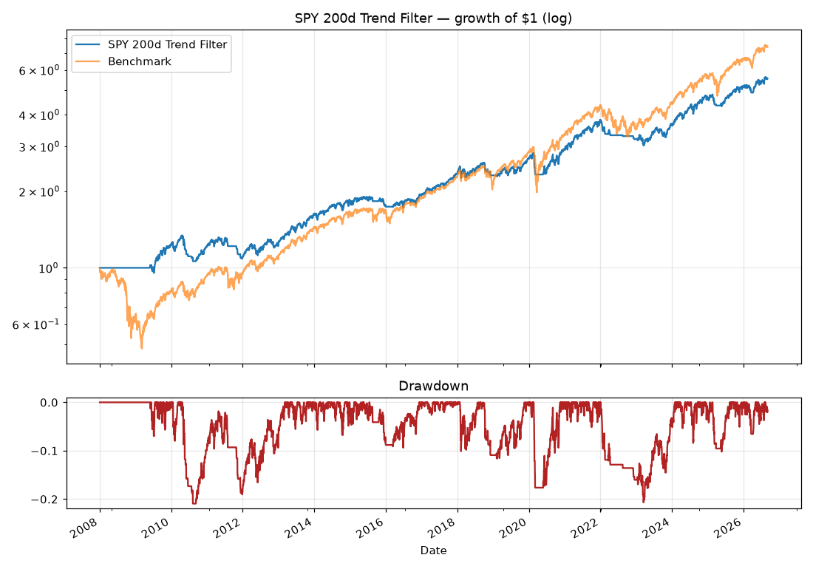

# Backtest: SPY 200d Trend Filter

Hold SPY when its close is above the 200-day moving average, otherwise cash. Checked daily.

**Period:** 2008-01-02 → 2026-09-02 · **Costs:** modeled per rebalance · **Avg annual turnover:** 4.9x

## Summary
| Metric | SPY 200d Trend Filter | Benchmark |
|---|---|---|
| CAGR | 9.62% | 11.35% |
| Vol | 11.66% | 19.75% |
| Sharpe | 0.85 | 0.64 |
| Sortino | 0.95 | 0.79 |
| MaxDD | -20.93% | -51.87% |
| Calmar | 0.46 | 0.22 |
| WinRate | 43.60% | 55.06% |
| BestDay | 4.40% | 14.52% |
| WorstDay | -5.76% | -10.94% |
| Total | 454.14% | 641.22% |
| Years | 18.64 | 18.64 |

## Robustness (sample halves)
| Metric | Full | 1st half | 2nd half |
|---|---|---|---|
| CAGR | 9.62% | 8.04% | 11.23% |
| Sharpe | 0.85 | 0.75 | 0.93 |
| MaxDD | -20.93% | -20.93% | -20.68% |

## Calendar-year returns
| Year | SPY 200d Trend Filter | Benchmark |
|---|---|---|
| 2008 | +0.0% | -36.2% |
| 2009 | +22.3% | +26.4% |
| 2010 | -1.1% | +15.1% |
| 2011 | -9.7% | +1.9% |
| 2012 | +13.2% | +16.0% |
| 2013 | +32.3% | +32.3% |
| 2014 | +11.6% | +13.5% |
| 2015 | -4.7% | +1.2% |
| 2016 | +10.4% | +12.0% |
| 2017 | +21.7% | +21.7% |
| 2018 | -1.2% | -4.6% |
| 2019 | +16.3% | +31.2% |
| 2020 | +9.6% | +18.3% |
| 2021 | +28.7% | +28.7% |
| 2022 | -15.5% | -18.2% |
| 2023 | +14.9% | +26.2% |
| 2024 | +24.9% | +24.9% |
| 2025 | +11.6% | +17.7% |
| 2026 | +8.1% | +12.8% |

_Generated 2026-09-03 by Claude Space backtester. Past performance is not indicative of future results. Research, not investment advice._
